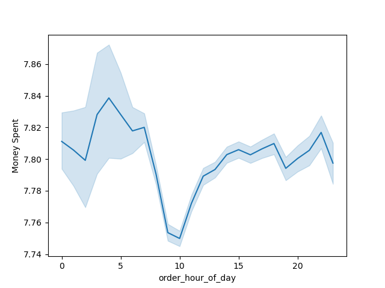

# Instacart Grocery Basket Analysis: A Case Study

## 📖 Introduction
Instacart, a leading online grocery delivery service, faced the challenge of optimizing its marketing strategies to better engage its diverse customer base. With a growing dataset of customer purchase behavior, the company sought to understand key patterns in ordering habits, product preferences, and customer demographics. This case study explores how a data-driven approach provided actionable insights to address these challenges.

---

## 🎯 Objectives
1. Identify the busiest days and times for placing orders to optimize ad scheduling.
2. Determine peak spending periods for product-specific advertisements.
3. Analyze product popularity across departments to focus marketing efforts.
4. Segment customers based on loyalty, region, and demographics.
5. Provide recommendations for targeted marketing strategies to enhance customer engagement and sales.

---

## 🛠️ Methodology
### 1. Data Collection and Preparation
- **Datasets:**
  - Customers Data: Demographics and purchasing behavior.
  - Orders Data: Detailed transaction records.
  - Products Data: Categories and details about items purchased.
- **Tools and Libraries:** Python, pandas, NumPy, matplotlib, seaborn.
- **Environment:** Jupyter Notebooks, Anaconda.

  **Data Citation:** "The Instacart Online Grocery Shopping Dataset 2017", Accessed from www.instacart.com/datasets/grocery-shopping-2017.

### 2. Data Wrangling
- Cleaned datasets to ensure consistency and accuracy.
- Merged datasets into a single unified view for comprehensive analysis.

### 3. Exploratory Data Analysis
- Investigated order frequency trends across days and hours.
- Analyzed spending behavior to identify peak periods.
- Studied product popularity by department.

### 4. Customer Segmentation
- Categorized customers based on:
  - Loyalty (order frequency and value).
  - Demographics (age, family status, region).
  - Purchasing behaviors (preferred products and spending habits).

### 5. Visualization
- Generated histograms, bar charts, scatterplots, and line graphs to communicate findings effectively.

---

## 💡 Insights
## **3. Insights**
### Peak Shopping Times

- **Weekends and evenings** were the busiest times for orders.
- High-spending customers preferred afternoons for premium products.

### Product Preferences

- Fresh produce and household essentials were the most ordered categories.

### Customer Segmentation
- **Loyal customers** placed frequent, high-value orders.
- Regional preferences varied significantly, with urban customers favoring convenience items.

---

## 🚀 Recommendations
1. **Optimize Ad Scheduling:**
   - Schedule ads during off-peak hours to balance order volume.
   - Promote high-value products during peak spending times.

2. **Focus on Popular Products:**
   - Prioritize marketing for fresh produce and household essentials.
   - Introduce bundles for specialty items to increase their appeal.

3. **Enhance Loyalty Programs:**
   - Reward frequent customers with personalized discounts and promotions.
   - Develop referral incentives to attract similar customer profiles.

4. **Tailor Regional Campaigns:**
   - Design offers that cater to urban and rural customer needs separately.

---

## 📂 Deliverables
1. Cleaned and merged datasets ready for analysis.
2. Visualizations highlighting key insights.
3. Final recommendations report for Instacart stakeholders.

---

## 🌐 Conclusion
This case study highlights how data analysis can uncover actionable insights to optimize marketing strategies. By understanding customer behaviors and preferences, Instacart is better positioned to engage its audience, boost sales, and strengthen customer loyalty.

---

